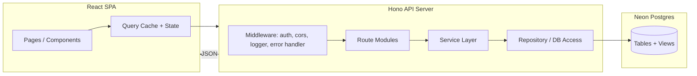
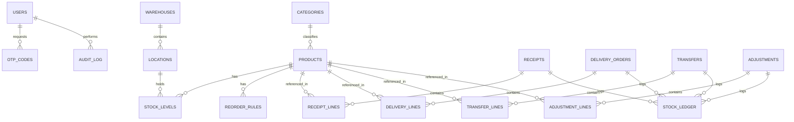

# StockSense — System Architecture & File Structure

## 1. Overview

StockSense is a modular Inventory Management System (IMS) covering authentication, a
real-time dashboard, product management, and the four core stock operations: Receipts,
Delivery Orders, Internal Transfers, and Stock Adjustments — all backed by an immutable
Stock Ledger.

**Stack**

| Layer     | Technology                          |
|-----------|--------------------------------------|
| Frontend  | React (Vite), React Router, TanStack Query, Zustand/Context for local state |
| Backend   | Hono (runs on Node.js / Bun / Cloudflare Workers) |
| Database  | PostgreSQL on Neon (serverless Postgres, branching) |
| ORM       | Drizzle ORM (or Prisma) with Neon's serverless HTTP/WebSocket driver |
| Auth      | JWT (access + refresh) + OTP for password reset (email/SMS provider) |
| Validation| Zod, shared between frontend and backend |
| Deployment| Backend on a Node/Bun host or Cloudflare Workers; Frontend on Vercel/Netlify; DB on Neon |

---

## 2. High-Level Architecture



**Request flow:** Client calls a REST endpoint → Hono middleware (auth/validation) → route
handler → service layer (business rules, e.g. "validating a receipt increases stock") →
repository layer (SQL via Drizzle) → Neon Postgres. Every stock-affecting action writes a
row to `stock_ledger` inside the same DB transaction that updates `stock_levels`.

---

## 3. Database Design (Neon Postgres)

### 3.1 Entity-Relationship Diagram



### 3.2 Core Tables

- **users** — id, name, email, password_hash, role (`inventory_manager` \| `warehouse_staff`), created_at
- **otp_codes** — id, user_id, code_hash, purpose (`password_reset`), expires_at, used_at
- **warehouses** — id, name, address
- **locations** — id, warehouse_id, name (e.g. "Rack A"), type
- **categories** — id, name, parent_id (nullable, for sub-categories)
- **products** — id, name, sku, category_id, uom, reorder_point, reorder_qty, is_active
- **stock_levels** — id, product_id, location_id, quantity *(current on-hand, derived/kept in sync via ledger)*
- **reorder_rules** — id, product_id, location_id, min_qty, max_qty
- **receipts** / **receipt_lines** — header (supplier, status, warehouse, dates) + lines (product, qty_expected, qty_received)
- **delivery_orders** / **delivery_lines** — header (customer/sales_order_ref, status, warehouse) + lines (product, qty_ordered, qty_picked, qty_delivered)
- **transfers** / **transfer_lines** — header (source_location, dest_location, status) + lines (product, qty)
- **adjustments** / **adjustment_lines** — header (location, reason, status) + lines (product, recorded_qty, counted_qty, delta)
- **stock_ledger** — id, product_id, location_id, delta_qty, source_type (`receipt`\|`delivery`\|`transfer`\|`adjustment`), source_id, balance_after, created_at, created_by *(append-only, single source of truth for Move History)*
- **audit_log** — id, user_id, action, entity, entity_id, created_at

`status` fields (Draft, Waiting, Ready, Done, Canceled) are shared enums used for dashboard filters across Receipts, Delivery, Internal Transfers, and Adjustments.

---

## 4. Backend Architecture (Hono)

Layered structure: **routes → controllers → services → repositories → db**, keeping Hono
handlers thin and business logic testable independently of the HTTP layer.

- **Middleware**: JWT auth guard, role-based access (manager vs. staff), request validation (Zod), centralized error handler, request logger, CORS.
- **Services** own transactional logic — e.g. `ReceiptService.validate()` opens a DB transaction, updates `stock_levels`, and inserts into `stock_ledger` atomically.
- **Repositories** wrap Drizzle queries per table/aggregate, keeping SQL out of services.

---

## 5. Backend File Structure

```
stocksense-api/
├── src/
│   ├── index.ts                     # Hono app bootstrap, route mounting
│   ├── config/
│   │   ├── env.ts                   # env var parsing/validation (zod)
│   │   └── db.ts                    # Neon connection (drizzle client)
│   ├── db/
│   │   ├── schema/
│   │   │   ├── users.schema.ts
│   │   │   ├── warehouses.schema.ts
│   │   │   ├── products.schema.ts
│   │   │   ├── receipts.schema.ts
│   │   │   ├── deliveries.schema.ts
│   │   │   ├── transfers.schema.ts
│   │   │   ├── adjustments.schema.ts
│   │   │   └── ledger.schema.ts
│   │   ├── migrations/              # drizzle-kit generated SQL migrations
│   │   └── seed.ts
│   ├── middleware/
│   │   ├── auth.middleware.ts
│   │   ├── role.middleware.ts
│   │   ├── error.middleware.ts
│   │   └── logger.middleware.ts
│   ├── modules/
│   │   ├── auth/
│   │   │   ├── auth.routes.ts
│   │   │   ├── auth.controller.ts
│   │   │   ├── auth.service.ts       # login, signup, JWT issuing
│   │   │   └── otp.service.ts        # generate/verify OTP for reset
│   │   ├── dashboard/
│   │   │   ├── dashboard.routes.ts
│   │   │   ├── dashboard.controller.ts
│   │   │   └── dashboard.service.ts  # KPI aggregation queries
│   │   ├── products/
│   │   │   ├── products.routes.ts
│   │   │   ├── products.controller.ts
│   │   │   ├── products.service.ts
│   │   │   └── products.repository.ts
│   │   ├── categories/
│   │   ├── warehouses/
│   │   ├── receipts/
│   │   │   ├── receipts.routes.ts
│   │   │   ├── receipts.controller.ts
│   │   │   ├── receipts.service.ts   # validate() -> stock +qty, ledger entry
│   │   │   └── receipts.repository.ts
│   │   ├── deliveries/
│   │   │   └── ...                   # pick/pack/validate -> stock -qty
│   │   ├── transfers/
│   │   │   └── ...                   # move between locations
│   │   ├── adjustments/
│   │   │   └── ...                   # recorded vs counted -> delta
│   │   └── ledger/
│   │       ├── ledger.routes.ts      # "Move History" endpoint
│   │       └── ledger.service.ts
│   ├── lib/
│   │   ├── jwt.ts
│   │   ├── password.ts               # hashing (argon2/bcrypt)
│   │   └── otp-provider.ts           # email/SMS sender abstraction
│   ├── shared/
│   │   ├── validators/                # zod schemas shared per module
│   │   └── constants.ts               # status enums, roles
│   └── types/
│       └── index.d.ts
├── drizzle.config.ts
├── .env.example
├── package.json
└── tsconfig.json
```

---

## 6. Frontend Architecture (React)

Feature-folder structure with a shared API client and query layer; each module (Products,
Receipts, Deliveries, Transfers, Adjustments) mirrors its backend counterpart.

- **API layer**: typed fetch client + TanStack Query hooks per module (`useProducts`, `useReceipts`, …), giving caching, refetching, and optimistic updates for validate/pick/pack actions.
- **Routing**: protected routes for Dashboard/Products/Operations, public routes for Login/Signup/Reset.
- **Shared UI**: KPI cards, status badges (Draft/Waiting/Ready/Done/Canceled), filter bar (document type, status, warehouse, category), data table.

---

## 7. Frontend File Structure

```
stocksense-web/
├── src/
│   ├── main.tsx
│   ├── App.tsx                      # route definitions
│   ├── api/
│   │   ├── client.ts                 # axios/fetch instance, interceptors (JWT)
│   │   ├── auth.api.ts
│   │   ├── products.api.ts
│   │   ├── receipts.api.ts
│   │   ├── deliveries.api.ts
│   │   ├── transfers.api.ts
│   │   ├── adjustments.api.ts
│   │   └── dashboard.api.ts
│   ├── hooks/
│   │   ├── useAuth.ts
│   │   ├── useProducts.ts
│   │   ├── useReceipts.ts
│   │   ├── useDeliveries.ts
│   │   ├── useTransfers.ts
│   │   ├── useAdjustments.ts
│   │   └── useDashboardKpis.ts
│   ├── pages/
│   │   ├── auth/
│   │   │   ├── LoginPage.tsx
│   │   │   ├── SignupPage.tsx
│   │   │   └── ResetPasswordPage.tsx   # OTP flow
│   │   ├── dashboard/
│   │   │   └── DashboardPage.tsx
│   │   ├── products/
│   │   │   ├── ProductListPage.tsx
│   │   │   └── ProductFormPage.tsx
│   │   ├── operations/
│   │   │   ├── ReceiptsPage.tsx
│   │   │   ├── ReceiptDetailPage.tsx
│   │   │   ├── DeliveryOrdersPage.tsx
│   │   │   ├── DeliveryDetailPage.tsx
│   │   │   ├── TransfersPage.tsx
│   │   │   ├── AdjustmentsPage.tsx
│   │   │   └── MoveHistoryPage.tsx
│   │   ├── settings/
│   │   │   └── WarehouseSettingsPage.tsx
│   │   └── profile/
│   │       └── MyProfilePage.tsx
│   ├── components/
│   │   ├── layout/
│   │   │   ├── Sidebar.tsx           # Products, Operations, Settings, Profile
│   │   │   ├── Topbar.tsx
│   │   │   └── AppLayout.tsx
│   │   ├── kpi/
│   │   │   └── KpiCard.tsx
│   │   ├── filters/
│   │   │   └── FilterBar.tsx         # doc type / status / warehouse / category
│   │   ├── table/
│   │   │   └── DataTable.tsx
│   │   └── ui/                       # buttons, badges, modals, inputs
│   ├── store/
│   │   └── auth.store.ts             # Zustand: current user, tokens
│   ├── lib/
│   │   ├── constants.ts              # status enums shared with backend
│   │   └── validators/                # zod schemas (forms)
│   ├── types/
│   │   └── index.ts
│   └── styles/
│       └── globals.css
├── vite.config.ts
├── .env.example
├── package.json
└── tsconfig.json
```

---

## 8. Key API Endpoints (summary)

| Module | Endpoints |
|---|---|
| Auth | `POST /auth/signup`, `POST /auth/login`, `POST /auth/otp/request`, `POST /auth/otp/verify`, `POST /auth/reset-password` |
| Dashboard | `GET /dashboard/kpis`, `GET /dashboard/filters` |
| Products | `GET/POST /products`, `GET/PATCH /products/:id`, `GET /products/:id/stock` |
| Receipts | `GET/POST /receipts`, `GET /receipts/:id`, `POST /receipts/:id/validate` |
| Deliveries | `GET/POST /deliveries`, `POST /deliveries/:id/pick`, `POST /deliveries/:id/pack`, `POST /deliveries/:id/validate` |
| Transfers | `GET/POST /transfers`, `POST /transfers/:id/validate` |
| Adjustments | `GET/POST /adjustments`, `POST /adjustments/:id/apply` |
| Ledger | `GET /ledger` (Move History, filterable) |
| Warehouses | `GET/POST /warehouses`, `GET/POST /locations` |

---

## 9. Cross-Cutting Concerns

- **Transactional integrity**: every "validate" action (receipt, delivery, transfer, adjustment) runs inside a single Postgres transaction that updates `stock_levels` and inserts a `stock_ledger` row — preventing partial stock updates.
- **Low-stock alerts**: a scheduled job or DB trigger compares `stock_levels` against `reorder_rules` and flags items for the dashboard KPI and notifications.
- **Multi-warehouse support**: all stock is keyed by `location_id` (not just `product_id`), so quantities are always scoped to a specific warehouse/location.
- **Auth & roles**: JWT access + refresh tokens; role checks distinguish Inventory Managers (full CRUD) from Warehouse Staff (transfers, picking, counting).
