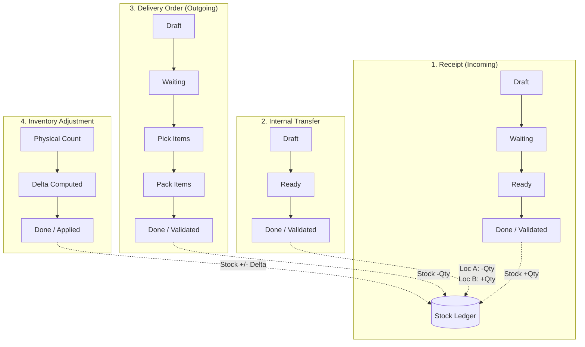

# StockSense — Master Engineering Implementation Plan

> **For AI / Engineers:** REQUIRED SUB-SKILL: Follow strict TDD, clean architecture, and modular domain separation. Each step must be implemented with comprehensive validation and zero regressions.

**Goal:** Build and ship **StockSense**, a production-grade, modular Inventory Management System (IMS) replacing manual spreadsheets and paper logs with real-time stock tracking, an immutable double-entry style stock ledger, multi-location inventory operations (Receipts, Deliveries, Transfers, Adjustments), OTP-based authentication, and a dynamic KPI dashboard.

**Architecture:** 
- **Backend:** Hono TypeScript application utilizing layered architecture (`routes` $\rightarrow$ `controllers` $\rightarrow$ `services` $\rightarrow$ `repositories` $\rightarrow$ `db`). Strict transactional guarantees ensure every stock modification updates location balances and appends to an immutable `stock_ledger` atomically.
- **Frontend:** React 19 SPA powered by Vite, TanStack Query v5 (server state & caching), Zustand (client state), Tailwind CSS, and Lucide Icons, featuring an accessible left-sidebar navigation and dense operational data tables.
- **Database:** PostgreSQL on Neon serverless with Drizzle ORM, providing connection pooling, branchable environments, and zero-downtime migrations.

**Tech Stack:** TypeScript 5.5+, Hono v4, React 19, Vite, TanStack Query v5, Drizzle ORM, Neon Serverless Postgres, Zod v3, Tailwind CSS v3/v4, Vitest.

---

## Table of Contents
1. [Core Domain Invariants & Mathematical Ledger Rules](#1-core-domain-invariants--mathematical-ledger-rules)
2. [End-to-End Flow & Operation State Machines](#2-end-to-end-flow--operation-state-machines)
3. [Phased Implementation Roadmap](#3-phased-implementation-roadmap)
   - [Phase 1: Workspace Scaffolding & Shared Infrastructure](#phase-1-workspace-scaffolding--shared-infrastructure)
   - [Phase 2: Database Schema & Migration Layer (Drizzle + Neon)](#phase-2-database-schema--migration-layer-drizzle--neon)
   - [Phase 3: Authentication, OTP Reset & RBAC Guard](#phase-3-authentication-otp-reset--rbac-guard)
   - [Phase 4: Stock Ledger Engine & Atomic Movement Pipeline](#phase-4-stock-ledger-engine--atomic-movement-pipeline)
   - [Phase 5: Products, Categories & Reordering Rules API](#phase-5-products-categories--reordering-rules-api)
   - [Phase 6: Core Operations API (Receipts, Deliveries, Transfers, Adjustments)](#phase-6-core-operations-api-receipts-deliveries-transfers-adjustments)
   - [Phase 7: Real-Time Dashboard & Dynamic Analytics Engine](#phase-7-real-time-dashboard--dynamic-analytics-engine)
   - [Phase 8: Frontend Design System & App Shell Architecture](#phase-8-frontend-design-system--app-shell-architecture)
   - [Phase 9: Frontend Pages & Interactive Workflows](#phase-9-frontend-pages--interactive-workflows)
   - [Phase 10: Testing, Verification & CI/CD Deployment](#phase-10-testing-verification--cicd-deployment)
4. [API Contract Specifications](#4-api-contract-specifications)
5. [Risk Analysis & Mitigation Strategies](#5-risk-analysis--mitigation-strategies)
6. [Acceptance Criteria & Definition of Done](#6-acceptance-criteria--definition-of-done)

---

## 1. Core Domain Invariants & Mathematical Ledger Rules

To prevent phantom inventory, negative unallocated stock, and race conditions, the system adheres to strict mathematical invariants:

1. **Immutable Ledger Rule:**
   - The `stock_ledger` table is strictly append-only.
   - Updates (`UPDATE`) and deletions (`DELETE`) on `stock_ledger` are blocked via application logic and PostgreSQL database rules.
   
2. **Dual-Entry Movement Invariant:**
   $$\text{Balance}_{\text{after}} = \text{Balance}_{\text{before}} + \Delta_{\text{quantity}}$$
   - For incoming stock (Receipts): $\Delta > 0$
   - For outgoing stock (Deliveries): $\Delta < 0$
   - For internal transfers: Two linked rows in the ledger: Source location ($\Delta < 0$) and Destination location ($\Delta > 0$) such that $\sum \Delta = 0$.
   - For stock adjustments: $\Delta = \text{Counted Quantity} - \text{Recorded Quantity}$.

3. **Atomic Transaction Invariant:**
   - No stock level is updated without an accompanying `stock_ledger` row within the exact same database transaction (`db.transaction(...)`). If the ledger insert fails, the stock level change rolls back immediately.

4. **Multi-Warehouse Isolation:**
   - Every physical item belongs to a specific `location_id`, which belongs to a specific `warehouse_id`. Stock is never stored globally without a location assignment.

---

## 2. End-to-End Flow & Operation State Machines

---

## 3. Phased Implementation Roadmap

### Phase 1: Workspace Scaffolding & Shared Infrastructure

#### Task 1.1: Root Workspace & Monorepo Configuration
- **Files:**
  - Create: `package.json` (root workspace config)
  - Create: `tsconfig.base.json`
  - Create: `.gitignore`
  - Create: `.editorconfig`
- **Actions:**
  1. Configure root workspace connecting `stocksense-api` and `stocksense-web`.
  2. Setup unified TypeScript compilation settings (`strict: true`, `noImplicitAny: true`, `target: ES2022`).
  3. Commit: `chore: initialize monorepo workspace and compiler configs`

#### Task 1.2: Shared Validation Schemas & Types Module
- **Files:**
  - Create: `stocksense-api/src/shared/constants.ts`
  - Create: `stocksense-api/src/shared/validators/auth.validator.ts`
  - Create: `stocksense-api/src/shared/validators/product.validator.ts`
  - Create: `stocksense-api/src/shared/validators/operations.validator.ts`
- **Actions:**
  1. Define status enums: `OperationStatus = ['draft', 'waiting', 'ready', 'done', 'canceled']`.
  2. Define roles: `UserRole = ['inventory_manager', 'warehouse_staff']`.
  3. Define Zod schemas for signup, login, OTP request, product creation, receipt creation, delivery order, transfer, and adjustment.
  4. Write unit tests for schema validation using Vitest.
  5. Commit: `feat(shared): add domain types, constants, and zod validation schemas`

---

### Phase 2: Database Schema & Migration Layer (Drizzle + Neon)

#### Task 2.1: Neon Database Connection & Pooling Client
- **Files:**
  - Create: `stocksense-api/src/config/env.ts`
  - Create: `stocksense-api/src/config/db.ts`
  - Create: `stocksense-api/drizzle.config.ts`
  - Create: `stocksense-api/.env.example`
- **Actions:**
  1. Parse environment variables using Zod (`DATABASE_URL`, `JWT_SECRET`, `PORT`, `NODE_ENV`).
  2. Configure Drizzle client using `@neondatabase/serverless` with WebSocket/HTTP pooled connection.
  3. Commit: `feat(db): configure Neon Postgres connection and drizzle client`

#### Task 2.2: Drizzle Relational Schema Definition
- **Files:**
  - Create: `stocksense-api/src/db/schema/users.schema.ts`
  - Create: `stocksense-api/src/db/schema/warehouses.schema.ts`
  - Create: `stocksense-api/src/db/schema/products.schema.ts`
  - Create: `stocksense-api/src/db/schema/stock-levels.schema.ts`
  - Create: `stocksense-api/src/db/schema/reorder-rules.schema.ts`
  - Create: `stocksense-api/src/db/schema/receipts.schema.ts`
  - Create: `stocksense-api/src/db/schema/deliveries.schema.ts`
  - Create: `stocksense-api/src/db/schema/transfers.schema.ts`
  - Create: `stocksense-api/src/db/schema/adjustments.schema.ts`
  - Create: `stocksense-api/src/db/schema/ledger.schema.ts`
  - Create: `stocksense-api/src/db/schema/audit.schema.ts`
  - Create: `stocksense-api/src/db/schema/index.ts`
- **Actions:**
  1. Define UUID primary keys, foreign keys with indexes on join targets (`product_id`, `location_id`, `warehouse_id`).
  2. Implement composite unique constraint on `stock_levels(product_id, location_id)`.
  3. Generate initial migration using `drizzle-kit generate`.
  4. Commit: `feat(db): implement comprehensive Drizzle relational database schemas`

#### Task 2.3: Database Migrations & Demonstration Seed Script
- **Files:**
  - Create: `stocksense-api/src/db/seed.ts`
- **Actions:**
  1. Seed initial warehouses: "Main Warehouse (WH-01)" and "Secondary Warehouse (WH-02)".
  2. Seed locations: "Main Store (Rack A1)", "Production Rack (Rack B1)", "Dispatch Bay (Bay 1)".
  3. Seed product categories: "Raw Materials", "Finished Goods", "Hardware".
  4. Seed initial products (e.g. "Steel Rods", "Office Chairs", "Fasteners") with SKUs and reorder rules.
  5. Seed demo users:
     - `manager@stocksense.io` (Role: `inventory_manager`)
     - `staff@stocksense.io` (Role: `warehouse_staff`)
  6. Commit: `feat(db): add automated database migration and demo seed script`

---

### Phase 3: Authentication, OTP Reset & RBAC Guard

#### Task 3.1: Password Hashing & JWT Security Subsystem
- **Files:**
  - Create: `stocksense-api/src/lib/password.ts`
  - Create: `stocksense-api/src/lib/jwt.ts`
- **Actions:**
  1. Implement secure password hashing and verification using `bcryptjs` or `argon2`.
  2. Implement JWT sign and verify helpers with distinct access token (15m expiry) and refresh token (7d expiry) lifetimes.
  3. Write unit tests verifying token signing, expiration, and invalid signature rejection.
  4. Commit: `feat(auth): implement cryptographic password hashing and JWT token utility`

#### Task 3.2: OTP Generation & Password Reset Service
- **Files:**
  - Create: `stocksense-api/src/lib/otp-provider.ts`
  - Create: `stocksense-api/src/modules/auth/otp.service.ts`
- **Actions:**
  1. Implement 6-digit cryptographically secure numerical OTP generator (`crypto.randomInt`).
  2. Hash OTP before storage in `otp_codes` table with 10-minute expiration timestamp.
  3. Implement rate-limiting check (max 3 requests per 15 minutes per email).
  4. Implement verification logic preventing replay attacks (`used_at` flag).
  5. Commit: `feat(auth): implement OTP password reset engine and rate limiter`

#### Task 3.3: Authentication Endpoints & Hono Middleware Guards
- **Files:**
  - Create: `stocksense-api/src/middleware/auth.middleware.ts`
  - Create: `stocksense-api/src/middleware/role.middleware.ts`
  - Create: `stocksense-api/src/middleware/error.middleware.ts`
  - Create: `stocksense-api/src/modules/auth/auth.controller.ts`
  - Create: `stocksense-api/src/modules/auth/auth.service.ts`
  - Create: `stocksense-api/src/modules/auth/auth.routes.ts`
- **Actions:**
  1. Mount endpoints:
     - `POST /auth/signup`
     - `POST /auth/login`
     - `POST /auth/refresh`
     - `POST /auth/otp/request`
     - `POST /auth/otp/verify`
     - `POST /auth/reset-password`
  2. Implement `authMiddleware` that validates Bearer token and attaches `user` context to Hono `c.set('user', user)`.
  3. Implement `requireRole('inventory_manager')` guard that returns `403 Forbidden` if role unauthorized.
  4. Commit: `feat(auth): mount auth routes and role-based access control middleware`

---

### Phase 4: Stock Ledger Engine & Atomic Movement Pipeline

#### Task 4.1: Transactional Stock Movement Engine
- **Files:**
  - Create: `stocksense-api/src/modules/ledger/ledger.service.ts`
  - Create: `stocksense-api/src/modules/ledger/ledger.repository.ts`
  - Test: `stocksense-api/tests/unit/ledger.service.test.ts`
- **Actions:**
  1. Implement `executeStockMovement(tx, { productId, locationId, deltaQty, sourceType, sourceId, userId })`:
     - Select current balance from `stock_levels` for `(productId, locationId)` with row-level lock (`FOR UPDATE`).
     - Calculate new balance: `newBalance = currentBalance + deltaQty`.
     - Invariant check: If `newBalance < 0` and allowNegative is false, throw `InsufficientStockError`.
     - Upsert `stock_levels` with `newBalance`.
     - Insert entry into `stock_ledger` with `(productId, locationId, deltaQty, sourceType, sourceId, balanceAfter, createdBy)`.
  2. Write unit tests for concurrent movements and rollback on failure.
  3. Commit: `feat(ledger): implement transactional stock ledger and atomic balance engine`

#### Task 4.2: Move History Audit Trail Endpoint
- **Files:**
  - Create: `stocksense-api/src/modules/ledger/ledger.controller.ts`
  - Create: `stocksense-api/src/modules/ledger/ledger.routes.ts`
- **Actions:**
  1. Implement `GET /ledger` with query parameters: `productId`, `locationId`, `sourceType`, `startDate`, `endDate`, `page`, `limit`.
  2. Include joined metadata: product SKU, product name, location name, warehouse name, user name.
  3. Commit: `feat(ledger): mount Move History query endpoint with full relational metadata`

---

### Phase 5: Products, Categories & Reordering Rules API

#### Task 5.1: Categories & Warehouses Management API
- **Files:**
  - Create: `stocksense-api/src/modules/categories/categories.routes.ts`
  - Create: `stocksense-api/src/modules/categories/categories.service.ts`
  - Create: `stocksense-api/src/modules/warehouses/warehouses.routes.ts`
  - Create: `stocksense-api/src/modules/warehouses/warehouses.service.ts`
- **Actions:**
  1. CRUD for categories (nested parent/child support).
  2. CRUD for warehouses and warehouse locations (racks, shelves, bays).
  3. RBAC: Only `inventory_manager` can create/update warehouses and categories.
  4. Commit: `feat(catalog): implement warehouses, locations, and categories API`

#### Task 5.2: Products Management with Initial Stock Support
- **Files:**
  - Create: `stocksense-api/src/modules/products/products.routes.ts`
  - Create: `stocksense-api/src/modules/products/products.controller.ts`
  - Create: `stocksense-api/src/modules/products/products.service.ts`
  - Create: `stocksense-api/src/modules/products/products.repository.ts`
- **Actions:**
  1. `POST /products`: Validates Name, SKU (unique), Category, Unit of Measure (UoM), optional `initialStock` object `{ locationId, quantity }`.
  2. If `initialStock` provided, automatically invokes `executeStockMovement` with `sourceType = 'initial_inventory'`.
  3. `GET /products`: List products with search filter (by SKU or Name), category filter, and calculated total stock.
  4. `GET /products/:id/stock`: Detailed stock breakdown across all warehouses and locations.
  5. Commit: `feat(products): implement product management with per-location stock aggregation`

#### Task 5.3: Reordering Rules & Low-Stock Alerts Engine
- **Files:**
  - Create: `stocksense-api/src/modules/products/reorder.service.ts`
  - Create: `stocksense-api/src/modules/products/reorder.routes.ts`
- **Actions:**
  1. CRUD for `reorder_rules` (`minQty`, `maxQty` per product and location).
  2. Service query `getLowStockItems()` comparing `stock_levels.quantity` $\le$ `reorder_rules.min_qty`.
  3. Commit: `feat(reorder): implement automated reorder rules and low-stock detection engine`

---

### Phase 6: Core Operations API (Receipts, Deliveries, Transfers, Adjustments)

#### Task 6.1: Receipts (Incoming Stock) Pipeline
- **Files:**
  - Create: `stocksense-api/src/modules/receipts/receipts.routes.ts`
  - Create: `stocksense-api/src/modules/receipts/receipts.controller.ts`
  - Create: `stocksense-api/src/modules/receipts/receipts.service.ts`
- **Actions:**
  1. `POST /receipts`: Create draft receipt with supplier, destination warehouse, and line items (`productId`, `qtyExpected`).
  2. `PATCH /receipts/:id`: Update quantities received (`qtyReceived`).
  3. `POST /receipts/:id/validate`:
     - Checks status is `ready` or `waiting`.
     - In transaction: loops through lines, increments `stock_levels` by `qtyReceived`, appends `stock_ledger` entries with `sourceType = 'receipt'`.
     - Updates receipt status to `done`.
  4. Example test: Receiving 50 units "Steel Rods" raises location stock by +50.
  5. Commit: `feat(operations): implement incoming goods receipts workflow with automatic stock increment`

#### Task 6.2: Delivery Orders (Outgoing Goods) Multi-Step Pipeline
- **Files:**
  - Create: `stocksense-api/src/modules/deliveries/deliveries.routes.ts`
  - Create: `stocksense-api/src/modules/deliveries/deliveries.controller.ts`
  - Create: `stocksense-api/src/modules/deliveries/deliveries.service.ts`
- **Actions:**
  1. `POST /deliveries`: Create order with customer ref, source warehouse, items & quantities. Status = `draft`.
  2. `POST /deliveries/:id/pick`: Validates item availability. Marks picked quantities. Status = `waiting` $\rightarrow$ `ready`.
  3. `POST /deliveries/:id/pack`: Verifies packed lines match picked lines.
  4. `POST /deliveries/:id/validate`:
     - In transaction: decrements `stock_levels` for each line item.
     - Appends ledger rows with negative delta ($\Delta < 0$) and `sourceType = 'delivery'`.
     - Updates status to `done`.
  5. Example test: Delivering 10 chairs decreases warehouse balance by -10.
  6. Commit: `feat(operations): implement 3-step delivery orders flow (pick, pack, validate)`

#### Task 6.3: Internal Transfers Pipeline
- **Files:**
  - Create: `stocksense-api/src/modules/transfers/transfers.routes.ts`
  - Create: `stocksense-api/src/modules/transfers/transfers.controller.ts`
  - Create: `stocksense-api/src/modules/transfers/transfers.service.ts`
- **Actions:**
  1. `POST /transfers`: Create transfer specifying `sourceLocationId`, `destLocationId`, items & quantities.
  2. `POST /transfers/:id/validate`:
     - In transaction: Checks source location has sufficient balance.
     - Decrements source location stock: $-\text{qty}$.
     - Increments destination location stock: $+\text{qty}$.
     - Creates two ledger entries tied to `transfer_id`.
     - Updates status to `done`.
  3. Example test: Moving 50 kg from Main Store to Production Rack leaves total stock unchanged while updating location breakdown.
  4. Commit: `feat(operations): implement internal transfers with atomic dual-location balance updates`

#### Task 6.4: Inventory Adjustments Pipeline
- **Files:**
  - Create: `stocksense-api/src/modules/adjustments/adjustments.routes.ts`
  - Create: `stocksense-api/src/modules/adjustments/adjustments.controller.ts`
  - Create: `stocksense-api/src/modules/adjustments/adjustments.service.ts`
- **Actions:**
  1. `POST /adjustments`: Specify `locationId`, `productId`, `countedQuantity`, and `reason` (e.g., "damaged goods", "annual audit").
  2. System fetches recorded stock and computes $\Delta = \text{counted} - \text{recorded}$.
  3. `POST /adjustments/:id/apply`:
     - Updates `stock_levels` to exactly equal `countedQuantity`.
     - Appends `stock_ledger` entry with delta and reason.
     - Updates status to `done`.
  4. Example test: 100 recorded, 97 counted $\rightarrow$ delta $-3$ kg, new balance 97 kg.
  5. Commit: `feat(operations): implement physical count inventory adjustment and delta reconciliation`

---

### Phase 7: Real-Time Dashboard & Dynamic Analytics Engine

#### Task 7.1: KPI Aggregation Service
- **Files:**
  - Create: `stocksense-api/src/modules/dashboard/dashboard.service.ts`
  - Create: `stocksense-api/src/modules/dashboard/dashboard.controller.ts`
  - Create: `stocksense-api/src/modules/dashboard/dashboard.routes.ts`
- **Actions:**
  1. Implement high-speed SQL queries for Dashboard KPIs:
     - **Total Products in Stock:** `SUM(quantity)` across active products.
     - **Low Stock / Out of Stock Items:** Count of products where total stock $\le$ reorder point or $= 0$.
     - **Pending Receipts:** Count of receipts in `draft`, `waiting`, or `ready` status.
     - **Pending Deliveries:** Count of delivery orders awaiting dispatch.
     - **Internal Transfers Scheduled:** Count of scheduled transfers not yet done.
  2. Commit: `feat(dashboard): implement real-time inventory KPI aggregation service`

#### Task 7.2: Unified Dynamic Operations Filter Endpoint
- **Files:**
  - Create: `stocksense-api/src/modules/dashboard/operations-query.service.ts`
- **Actions:**
  1. Endpoint `GET /dashboard/operations` supporting dynamic combined filters:
     - `docType`: `receipt` | `delivery` | `internal` | `adjustment`
     - `status`: `draft` | `waiting` | `ready` | `done` | `canceled`
     - `warehouseId` or `locationId`
     - `categoryId`
  2. Implement pagination and sorting.
  3. Commit: `feat(dashboard): implement multi-dimensional operations search and filter query`

---

### Phase 8: Frontend Design System & App Shell Architecture

#### Task 8.1: Vite Setup, Tailwind Theme & Component Primitives
- **Files:**
  - Create: `stocksense-web/src/styles/globals.css`
  - Create: `stocksense-web/src/components/ui/Button.tsx`
  - Create: `stocksense-web/src/components/ui/Badge.tsx`
  - Create: `stocksense-web/src/components/ui/Input.tsx`
  - Create: `stocksense-web/src/components/ui/Modal.tsx`
  - Create: `stocksense-web/src/components/ui/Select.tsx`
- **Actions:**
  1. Configure Tailwind CSS with modern theme tokens (slate/indigo/emerald/rose palette).
  2. Implement reusable UI primitives with accessibility and focus states.
  3. Commit: `feat(web): configure tailwind design tokens and reusable UI primitives`

#### Task 8.2: App Layout, Sidebar Navigation & Topbar
- **Files:**
  - Create: `stocksense-web/src/components/layout/AppLayout.tsx`
  - Create: `stocksense-web/src/components/layout/Sidebar.tsx`
  - Create: `stocksense-web/src/components/layout/Topbar.tsx`
- **Actions:**
  1. Build Left Sidebar navigation matching spec:
     - **Products:** Products List, Product Categories, Reordering Rules
     - **Operations:** Receipts (Incoming), Delivery Orders (Outgoing), Inventory Adjustment, Internal Transfers, Move History
     - **Dashboard**
     - **Settings:** Warehouse & Location Settings
     - **Profile Menu (Left Sidebar bottom):** My Profile, Logout
  2. Topbar: Warehouse switcher dropdown, quick global search bar (SKU / Name), Low-stock alerts notification badge, user profile chip.
  3. Commit: `feat(web): build responsive AppLayout with left sidebar navigation and operational topbar`

#### Task 8.3: Dynamic Filter Bar & Data Table Components
- **Files:**
  - Create: `stocksense-web/src/components/filters/FilterBar.tsx`
  - Create: `stocksense-web/src/components/table/DataTable.tsx`
  - Create: `stocksense-web/src/components/kpi/KpiCard.tsx`
  - Create: `stocksense-web/src/components/ui/StatusBadge.tsx`
- **Actions:**
  1. `FilterBar`: Segmented pill controls for Document Type, Status chips (`Draft`, `Waiting`, `Ready`, `Done`, `Canceled`), Warehouse selector, and Category dropdown.
  2. `DataTable`: Generic typed table with sorting, pagination, empty states, and loading skeletons.
  3. `StatusBadge`: Consistent color-coding per status (`draft` = slate, `waiting` = amber, `ready` = blue, `done` = emerald, `canceled` = red).
  4. Commit: `feat(web): implement dynamic filter bar, generic data table, and KPI cards`

---

### Phase 9: Frontend Pages & Interactive Workflows

#### Task 9.1: Authentication & OTP Password Reset UI
- **Files:**
  - Create: `stocksense-web/src/pages/auth/LoginPage.tsx`
  - Create: `stocksense-web/src/pages/auth/SignupPage.tsx`
  - Create: `stocksense-web/src/pages/auth/ResetPasswordPage.tsx`
  - Create: `stocksense-web/src/store/auth.store.ts`
- **Actions:**
  1. Login and Signup forms with Zod client validation and error messages.
  2. OTP Password Reset flow:
     - Step 1: Input registered email $\rightarrow$ request OTP.
     - Step 2: 6-digit OTP code entry component with countdown timer.
     - Step 3: Enter new password and confirm $\rightarrow$ automatic redirect to login.
  3. Store JWT tokens in secure storage and initialize Zustand auth state.
  4. Commit: `feat(web): implement authentication pages and 3-step OTP password reset UI`

#### Task 9.2: Dashboard Page with Live KPIs and Dynamic Filters
- **Files:**
  - Create: `stocksense-web/src/pages/dashboard/DashboardPage.tsx`
  - Create: `stocksense-web/src/hooks/useDashboardKpis.ts`
- **Actions:**
  1. Render 5 core KPI Cards:
     - Total Products in Stock
     - Low Stock / Out of Stock Items (with red alert indicator)
     - Pending Receipts
     - Pending Deliveries
     - Internal Transfers Scheduled
  2. Embed dynamic operations filter bar and live operations table.
  3. Commit: `feat(web): build interactive dashboard with live KPI cards and operational filters`

#### Task 9.3: Product Catalog & Location Stock Views
- **Files:**
  - Create: `stocksense-web/src/pages/products/ProductListPage.tsx`
  - Create: `stocksense-web/src/pages/products/ProductFormPage.tsx`
  - Create: `stocksense-web/src/components/products/LocationStockModal.tsx`
- **Actions:**
  1. Product list with search-as-you-type (SKU / Name), category badges, and quick stock level preview.
  2. Product creation form: Name, SKU, Category, UoM, optional Initial Stock allocation.
  3. "Stock per Location" modal/drawer displaying quantity breakdown across racks and warehouses.
  4. Commit: `feat(web): build product management catalog and per-location inventory modal`

#### Task 9.4: Receipts (Incoming Goods) Management UI
- **Files:**
  - Create: `stocksense-web/src/pages/operations/ReceiptsPage.tsx`
  - Create: `stocksense-web/src/pages/operations/ReceiptDetailPage.tsx`
- **Actions:**
  1. Receipts list grouped by status tabs.
  2. Create Receipt drawer: Select supplier, destination warehouse, and product line items.
  3. Receipt detail view: Input quantities received and click "Validate" with confirmation modal.
  4. Instant TanStack Query cache invalidation updating dashboard KPIs and product stock.
  5. Commit: `feat(web): implement receipts operational view and validation flow`

#### Task 9.5: Delivery Orders (Outgoing Goods) UI with Pick & Pack Stepper
- **Files:**
  - Create: `stocksense-web/src/pages/operations/DeliveryOrdersPage.tsx`
  - Create: `stocksense-web/src/pages/operations/DeliveryDetailPage.tsx`
  - Create: `stocksense-web/src/components/operations/OrderProgressStepper.tsx`
- **Actions:**
  1. Delivery orders table with status badges.
  2. Interactive detail page with a visual stepper (`Draft` $\rightarrow$ `Pick` $\rightarrow$ `Pack` $\rightarrow$ `Validate / Ship`).
  3. Action buttons: "Confirm Picking", "Confirm Packing", "Validate & Dispatch".
  4. Real-time warning if warehouse stock is insufficient for picking.
  5. Commit: `feat(web): build delivery orders page with pick, pack, and ship workflow stepper`

#### Task 9.6: Internal Transfers & Stock Adjustments UI
- **Files:**
  - Create: `stocksense-web/src/pages/operations/TransfersPage.tsx`
  - Create: `stocksense-web/src/pages/operations/AdjustmentsPage.tsx`
- **Actions:**
  1. Transfers view: Form to select Source Warehouse/Rack, Destination Warehouse/Rack, Product, and Qty. Validate button commits dual movement.
  2. Adjustments view: Physical inventory reconciliation form. Select product & location, view recorded stock, enter counted physical stock. Automatically displays computed $\Delta$ (+/-). Validate button reconciles stock.
  3. Commit: `feat(web): build internal transfers and physical count stock adjustment interfaces`

#### Task 9.7: Move History & Settings Pages
- **Files:**
  - Create: `stocksense-web/src/pages/operations/MoveHistoryPage.tsx`
  - Create: `stocksense-web/src/pages/settings/WarehouseSettingsPage.tsx`
  - Create: `stocksense-web/src/pages/profile/MyProfilePage.tsx`
- **Actions:**
  1. Move History page: Immutable ledger viewer with date range picker, SKU filter, transaction type badge (`receipt`, `delivery`, `transfer`, `adjustment`), and running balance.
  2. Warehouse Settings: Add/manage warehouses and specific storage locations (Racks, Shelves, Bays).
  3. My Profile: View user details, assigned role badge, change password, and session management.
  4. Commit: `feat(web): implement move history audit log, warehouse settings, and user profile`

---

### Phase 10: Testing, Verification & CI/CD Deployment

#### Task 10.1: Unit & Integration Automated Test Suite
- **Files:**
  - Create: `stocksense-api/tests/integration/receipts.test.ts`
  - Create: `stocksense-api/tests/integration/deliveries.test.ts`
  - Create: `stocksense-api/tests/integration/transfers.test.ts`
  - Create: `stocksense-api/tests/integration/adjustments.test.ts`
  - Create: `stocksense-api/tests/integration/auth.test.ts`
- **Actions:**
  1. Test the full 4-step example from the spec:
     - Step 1: Receive 100 kg steel $\rightarrow$ stock +100.
     - Step 2: Internal transfer Main Store $\rightarrow$ Production Rack $\rightarrow$ location balance updated, company stock invariant maintained.
     - Step 3: Deliver 20 kg steel $\rightarrow$ stock -20.
     - Step 4: Adjust 3 kg damaged $\rightarrow$ delta -3, final balance 77 kg.
  2. Verify all 4 movements are correctly recorded in `stock_ledger`.
  3. Run: `npm run test` in `stocksense-api`.
  4. Commit: `test: add comprehensive end-to-end integration test suite for inventory operations`

#### Task 10.2: CI/CD Pipeline & Production Build Verification
- **Files:**
  - Create: `.github/workflows/ci.yml`
  - Create: `stocksense-api/Dockerfile`
  - Create: `stocksense-web/Dockerfile`
- **Actions:**
  1. Setup GitHub Actions workflow to run type-checking (`tsc --noEmit`), linting (`eslint`), and Vitest test suite on push and PR.
  2. Create production multi-stage Docker builds.
  3. Commit: `ci: add GitHub Actions workflow and production Dockerfiles`

---

## 4. API Contract Specifications

### 4.1 Authentication Endpoints

| Method | Path | Request Body | Response (200 OK) | Description |
|---|---|---|---|---|
| `POST` | `/auth/signup` | `{ name, email, password, role }` | `{ user, token, refreshToken }` | Register new user |
| `POST` | `/auth/login` | `{ email, password }` | `{ user, token, refreshToken }` | User login |
| `POST` | `/auth/otp/request` | `{ email }` | `{ success: true, message }` | Sends 6-digit OTP |
| `POST` | `/auth/otp/verify` | `{ email, code }` | `{ resetToken }` | Validates OTP code |
| `POST` | `/auth/reset-password` | `{ resetToken, newPassword }` | `{ success: true }` | Resets user password |

### 4.2 Dashboard & Analytics Endpoints

| Method | Path | Query Params | Response | Description |
|---|---|---|---|---|
| `GET` | `/dashboard/kpis` | `warehouseId?` | `{ totalProducts, lowStockItems, pendingReceipts, pendingDeliveries, internalTransfersScheduled }` | Real-time KPI summary |
| `GET` | `/dashboard/operations` | `type?, status?, warehouseId?, categoryId?, page, limit` | `{ data: Operation[], total, page, totalPages }` | Filtered operations list |

### 4.3 Inventory Operations Endpoints

| Method | Path | Request Body | Description |
|---|---|---|---|
| `POST` | `/receipts` | `{ supplier, warehouseId, lines: [{ productId, qtyExpected }] }` | Create incoming receipt |
| `POST` | `/receipts/:id/validate` | `{ lines: [{ productId, qtyReceived }] }` | Validate receipt $\rightarrow$ increases stock & logs ledger |
| `POST` | `/deliveries` | `{ customerRef, warehouseId, lines: [{ productId, qtyOrdered }] }` | Create delivery order |
| `POST` | `/deliveries/:id/pick` | `{ lines: [{ productId, qtyPicked }] }` | Pick items for order |
| `POST` | `/deliveries/:id/pack` | `{ lines: [{ productId, qtyPacked }] }` | Pack items for shipment |
| `POST` | `/deliveries/:id/validate` | `{}` | Validate delivery $\rightarrow$ decreases stock & logs ledger |
| `POST` | `/transfers` | `{ sourceLocationId, destLocationId, lines: [{ productId, qty }] }` | Schedule internal transfer |
| `POST` | `/transfers/:id/validate` | `{}` | Validate transfer $\rightarrow$ moves stock between locations |
| `POST` | `/adjustments` | `{ locationId, productId, countedQty, reason }` | Create physical count adjustment |
| `POST` | `/adjustments/:id/apply` | `{}` | Reconcile count $\rightarrow$ writes delta to stock & ledger |
| `GET` | `/ledger` | `productId?, locationId?, sourceType?, page, limit` | View Move History audit trail |

---

## 5. Risk Analysis & Mitigation Strategies

| Risk | Impact | Likelihood | Mitigation Strategy |
|---|:---:|:---:|---|
| **Concurrent Stock Deductions** (Race Conditions) | High | Medium | Execute stock deductions inside PostgreSQL transactions with row-level locks (`SELECT ... FOR UPDATE`) on `stock_levels`. |
| **Phantom / Negative Stock** | High | Low | Invariant checks in `executeStockMovement` reject transactions that would result in negative balances unless explicitly configured. |
| **Partial Operations Update** | High | Low | Atomic transactions wrap both `stock_levels` update and `stock_ledger` insert. Failure rolls back both. |
| **OTP Brute-Force Attacks** | Medium | Medium | Limit OTP attempts to 5 failures per code; rate-limit OTP generation requests to 3 per 15 minutes per IP/email. |
| **Stale Frontend Stock Caches** | Low | High | Utilize TanStack Query mutation lifecycle: automatically invalidate `['stock', 'products', 'dashboard']` query keys on every operation validation. |

---

## 6. Acceptance Criteria & Definition of Done

- [x] **Authentication:** Sign-up, login, and 3-step OTP password reset work seamlessly.
- [x] **Dashboard:** All 5 KPIs (Total Products, Low Stock, Pending Receipts, Pending Deliveries, Scheduled Transfers) calculate accurately and respond to warehouse/category filters.
- [x] **Navigation:** Left sidebar provides direct access to Products, Operations (Receipts, Deliveries, Adjustments, Transfers, Move History), Dashboard, Settings (Warehouses), and Profile.
- [x] **Product Management:** Full CRUD with Name, SKU, Category, UoM, and optional initial stock allocation.
- [x] **Receipts:** Validating receipts automatically increases stock levels and creates ledger records.
- [x] **Delivery Orders:** Pick $\rightarrow$ Pack $\rightarrow$ Validate workflow decreases stock and rejects insufficient quantities.
- [x] **Internal Transfers:** Moves stock between locations (Main Store $\rightarrow$ Production Rack) preserving total inventory invariants.
- [x] **Stock Adjustments:** Computes $\Delta = \text{counted} - \text{recorded}$ and reconciles physical stock with ledger audit reason.
- [x] **Move History:** Complete ledger entries viewable, searchable, and filterable.
- [x] **Excalidraw Mockup Alignment:** UI layouts match [StockSense Wireframes](https://link.excalidraw.com/l/65VNwvy7c4X/3ENvQFu9o8R).
